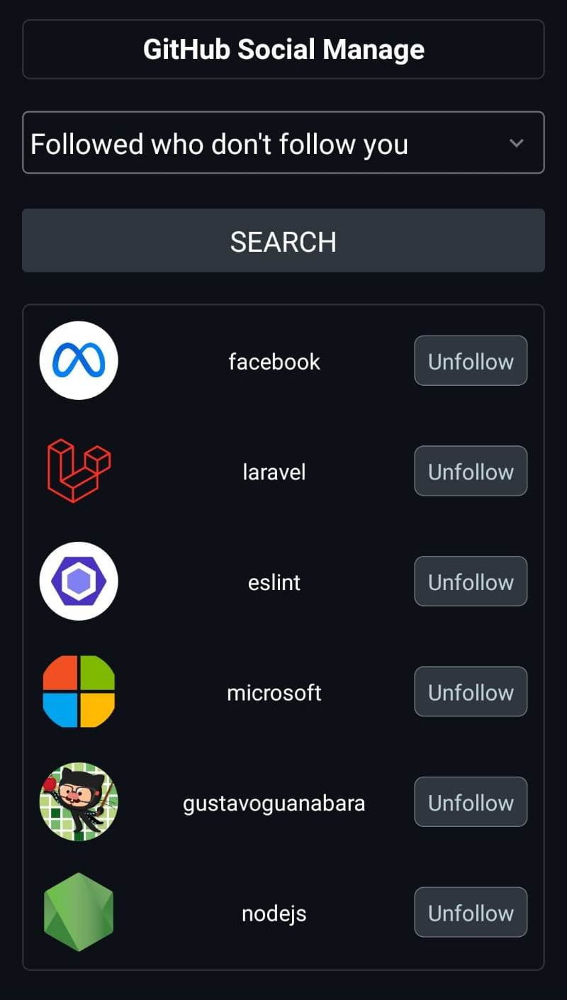
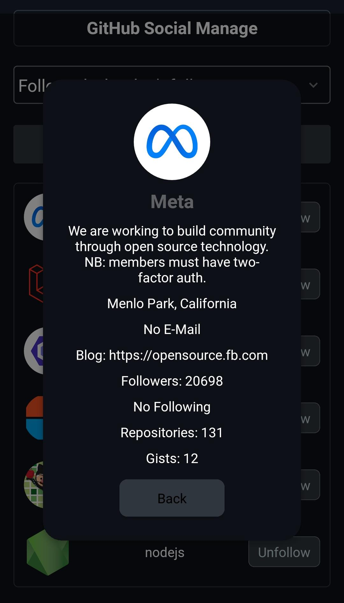
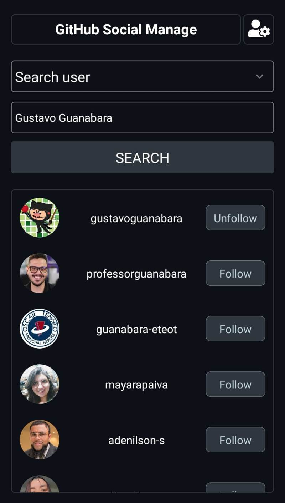
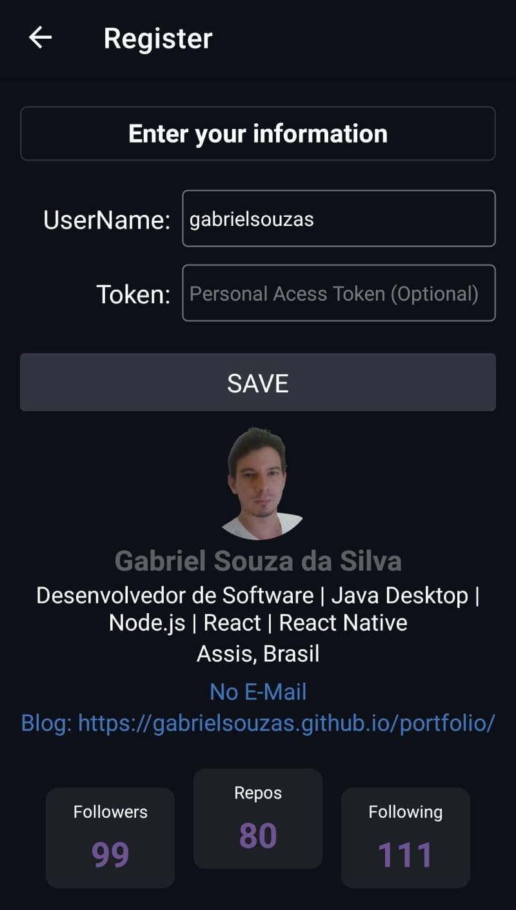

#  GitHub Social Management - React Native App

GitHub Social Management is a mobile application built in React Native that allows you to explore and manage a user's followers on GitHub. The application uses AsyncStorage to store information locally and the GitHub API to obtain and control real-time data.

## 🚀 Functionalities

- See a GitHub user's following and followers;
- Compare followers and see who doesn't follow a user back;
- Compare followers and see who follows a user and isn't followed back;
- Follow or unfollow a user from the app itself;
- View a Github user's complete data according to the GitHub API;
- Search for a user or organization by their login or name;
- View your updated GitHub information.

## 📷 Screenshots

   

## 🛠️ Tools, Technologies, and Libraries

[](https://reactnative.dev/) </br>
[](https://reactnative.dev/) </br>
[](https://expo.dev/) </br>
[](https://react-native-async-storage.github.io/async-storage/) </br>
[](https://developer.github.com/v3/) </br>
[](https://developer.github.com/v3/)

## ⚙️ Prerequisites

Make sure you have the React Native environment configured on your machine. For more information, see [React Native - Getting Started](https://reactnative.dev/docs/getting-started).

Or use Expo, see [Expo.dev](https://expo.dev/).

## 🔧 Installation

1. Clone the repository:

```bash
git clone https://github.com/gabrielsouzas/github-social-ctrl-react-native.git
```

2. Navigate to the project directory:

```bash
cd github-social-ctrl-react-native
```

3. Install dependencies:

```bash
npm install
```

or

```bash
yarn install
```

## ▶️ Usage

Run the application on an emulator or physical device with Expo:

```bash
cd github-social-ctrl-react-native
npx expo start
```

## 📡 API Requests

The following are the main requests made to the GitHub API.

### 1. Get User Followers

**Endpoint:** `GET /users/{username}/followers`

**Description:** Retrieves the list of followers for a given GitHub user.

### 2. Get User Following

**Endpoint:** `GET /users/{username}/following`

**Description:** Fetches the list of users that a given GitHub user is following.

### 3. Follow User

**Endpoint:** `PUT /user/following/{username}`

**Description:** Follow a GitHub user.

**Note:** Provide access token.

### 4. UnFollow User

**Endpoint:** `DELETE /user/following/{username}`

**Description:** UnFollow a GitHub user.

**Note:** Provide access token.

### 4. Get User Details

**Endpoint:** `GET /users/{username}`

**Description:** Retrieves detailed information about a specific GitHub user.

### 5. Search User

**Endpoint:** `GET /search/users`

**Description:** Returns users with the name matching the given search string.

Feel free to explore the corresponding code in the source files to understand the implementation details.

### 6. Publish

#### AAB

#### APK - Build APKs for Android Emulators and devices

1. Configuring a profile to build APKs

To generate an .apk, modify the eas.json by adding one of the following properties in a build profile:

- developmentClient to true (default)
- distribution to internal
- android.buildType to apk
- android.gradleCommand to :app:assembleRelease, :app:assembleDebug or any other gradle command that produces .apk

Example: eas.json

```json
{
  "build": {
    "preview": {
      "android": {
        "buildType": "apk"
      }
    },
    "preview2": {
      "android": {
        "gradleCommand": ":app:assembleRelease"
      }
    },
    "preview3": {
      "developmentClient": true
    },
    "preview4": {
      "distribution": "internal"
    },
    "production": {}
  }
}
```

2. Now you can run your build with the following command:

```shell
eas build -p android --profile preview
```

Remember that you can name the profile whatever you like. We named the profile preview. However, you can call it local, emulator, or whatever makes the most sense for you.

3. Download and install your APK in [Expo.dev](https://expo.dev/) or by the link provided at the end of the build

To install, transfer the APK file to a device or emulator. A device will be asked for permission for potentially dangerous applications, as it has not been verified by Play Protect (Play Store). The application will only be installed with this permission granted.

## 🤝 Contribution

Contributions are welcome! Feel free to open issues, propose improvements or send pull requests.

## 📄 License

This project is distributed under the MIT License.
